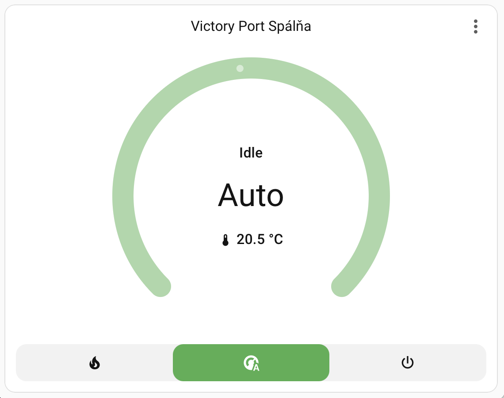
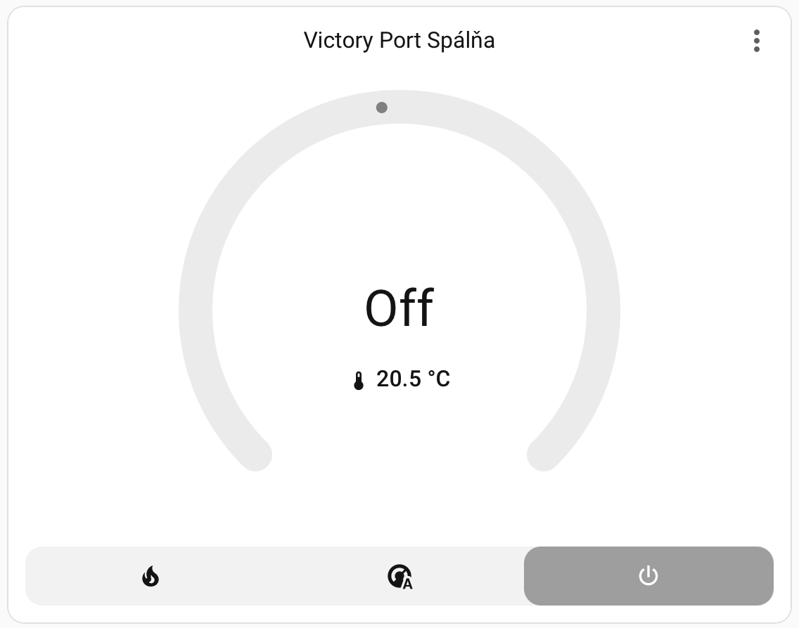

 [](https://github.com/hacs/integration)

# FENIX TFT WiFi Home Assistant Integration

This is a custom Home Assistant integration for the [FENIX TFT WiFi thermostat](https://www.fenixgroup.cz/en/products/thermostat-fenix-tft-wifi).

**🏠 Smart Thermostat Control** **⚡ Energy Monitoring** **🌡️ Multi-Sensor Support** **📊 Energy Dashboard**

## Screenshots

Here is the thermostat integration in action.

<p float="left">
  
  
  
</p>

## Project status

- **Reverse engineered API**: This integration is based on reverse engineering the FENIX cloud API. It is a work in progress and intended as a fun project for developers and advanced users.
- **Not officially supported**: This is not an official FENIX Group product and is not affiliated with them.

## Features

### ✅ Current Features

- **Climate Control**: Temperature control, heating modes (Off/Manual/Program), real-time monitoring
- **Energy Monitoring**: Daily consumption tracking with Home Assistant Energy Dashboard integration
- **Holiday Mode**: Set and cancel holiday schedules with automatic control locking during holidays
- **Multi-Sensor Support**: Room/floor temperatures, target & difference metrics, HVAC status, connectivity, energy, holiday state & end timestamp
- **Multi-Device**: Supports multiple thermostats across different rooms

### 🚧 Planned & Ideas

- **Smart Scheduling**: Full scheduling system, calendar integration
- **Enhanced Diagnostics**: Additional device sensors and operational data

### 💡 Contributing

Help wanted with testing, translations, documentation, and feature requests!

## Getting started

### Login credentials

To use this integration, you only need your **FENIX account email and password**.  

### Installation

#### Manual installation

1. Clone this repository into your Home Assistant `custom_components` folder:

    ```bash
    git clone https://github.com/baracudaz/fenix_tft.git custom_components/fenix_tft
    ```

2. Restart Home Assistant.
3. Add the integration via the Home Assistant and provide your **email** and **password**.

#### Installation via HACS

1. Open [HACS](https://www.hacs.xyz) in your Home Assistant instance.
2. Go to "Integrations" and click the three dots in the top right, then select "Custom repositories".
3. Add `https://github.com/baracudaz/fenix_tft` as a custom repository and select "Integration" as the category.
4. Install the integration from HACS.
5. Restart Home Assistant.
6. Add the integration via the Home Assistant and provide your **email** and **password**.

### Configuration

- During setup, you will be prompted for your **email** and **password** used in the FENIX Control app.
- The integration will take care of acquiring and refreshing tokens automatically in the background.

## Services

The integration provides three services for managing holiday schedules and importing historical energy data.

### `fenix_tft.set_holiday_schedule`

Set a holiday schedule for all thermostats in the installation. This overrides the normal weekly program for the specified period.

**Parameters:**

- `entity_id` (required): Any thermostat entity from the installation (schedule applies to all thermostats sharing its installation)
- `start_date` (required): When the holiday schedule should start
- `end_date` (required): When the holiday schedule should end
- `mode` (required): Heating mode during the holiday period
  - `off`: Turn heating off completely
  - `reduce`: Eco/reduced temperature mode
  - `defrost`: Defrost mode (frost protection)
  - `sunday`: Use Sunday schedule

**Example automation:**

```yaml
automation:
  - alias: "Set vacation mode"
    trigger:
      - platform: calendar
        entity_id: calendar.vacation
        event: start
    action:
      - service: fenix_tft.set_holiday_schedule
        data:
          entity_id: climate.your_thermostat
          start_date: "{{ now() }}"
          end_date: "{{ states('calendar.vacation').as_datetime }}"
          mode: "reduce"
```

### `fenix_tft.cancel_holiday_schedule`

Cancel the active or scheduled holiday, returning all thermostats to their normal weekly program.

**Parameters:**

- `entity_id` (required): Any thermostat entity from the installation (cancellation applies installation-wide)

**Example automation:**

```yaml
automation:
  - alias: "Cancel vacation mode when home"
    trigger:
      - platform: state
        entity_id: person.john
        to: "home"
    action:
      - service: fenix_tft.cancel_holiday_schedule
        data:
          entity_id: climate.your_thermostat
```

**Note:** Holiday schedules apply to all thermostats in an installation (all devices in your home). During an active holiday period, thermostat controls are automatically locked to prevent conflicts.

### `fenix_tft.import_historical_statistics`

Import historical energy consumption data as external statistics. This service intelligently detects existing data and backfills only older data to prevent duplicates and double-counting. Data is imported as a separate external statistic (e.g., `fenix_tft:bedroom_daily_energy_consumption_history`) to avoid interfering with the main sensor's current data.

**Smart Aggregation:** The service automatically uses the optimal data granularity:

- **Hourly data** for the most recent 7 days
- **Daily data** for 8-90 days back
- **Monthly data** for 91+ days back

**Parameters:**

- `energy_entity` (required): Energy sensor to import data for (e.g., `sensor.bedroom_daily_energy_consumption`)
- `days_back` (required): Number of days of historical data to import (1-365)

**Behavior:**

- If no statistics exist: Imports data from today back to the specified number of days
- If statistics exist: Detects the first recorded data point and imports the specified number of days BEFORE that timestamp (ending 1 hour before existing data to avoid overlap)
- Example: If data exists from Oct 25 10:00 and you request 30 days, it imports Sept 25 09:00 to Oct 25 09:00

**Example service call:**

```yaml
service: fenix_tft.import_historical_statistics
data:
  energy_entity: sensor.bedroom_daily_energy_consumption
  days_back: 30
```

**Use cases:**

- Initial setup: Import historical data to populate the Energy Dashboard
- Data gaps: Backfill missing periods after connectivity issues
- Migration: Import data when moving from another system

**Note:** Imported data appears as a separate external statistic (e.g., `fenix_tft:bedroom_daily_energy_consumption_history`) that can be added to the Energy Dashboard. This keeps historical imports separate from the main sensor's current data. The service maintains cumulative sum continuity and aligns with Home Assistant's hourly statistic buckets to prevent double-counting.

## Sensors

Each thermostat provides a set of sensors you can use in dashboards, automations, and energy tracking:

| Sensor | Description |
|--------|-------------|
| `*_ambient_temperature` | Current room temperature (°C). |
| `*_floor_temperature` | Floor probe temperature (°C). |
| `*_target_temperature` | Target temperature (°C). |
| `*_temperature_difference` | Target minus current temperature (°C). |
| `*_floor_air_difference` | Floor minus ambient temperature (°C). |
| `*_hvac_state` | Heating state: `heating`, `idle`, `off`. |
| `*_connectivity_status` | `connected` / `disconnected`. |
| `*_daily_energy_consumption` | Accumulated energy for today (Wh). |
| `*_holiday_mode` | Display name of the current holiday mode or `None`. Includes rich attributes. |
| `*_holiday_schedule_until` | Timestamp when the holiday ends (if active). |

## Inspiration

This project was inspired by:

- [Watts Vision for Home Assistant](https://github.com/pwesters/watts_vision)
- [homebridge-fenix-tft-wifi](https://github.com/tomas-kulhanek/homebridge-fenix-tft-wifi)

## Product information

- [FENIX TFT WiFi Thermostat product page](https://www.fenixgroup.cz/en/products/thermostat-fenix-tft-wifi)
- [FENIX Control app on Apple App Store](https://apps.apple.com/ch/app/fenix-control/id1474206689?l=en-GB)
- [FENIX Control app on Google Play](https://play.google.com/store/apps/details?id=com.Fenix.TftWifi.Mobile)

---

Feel free to contribute, open issues, or share feedback as you explore and extend this integration!
